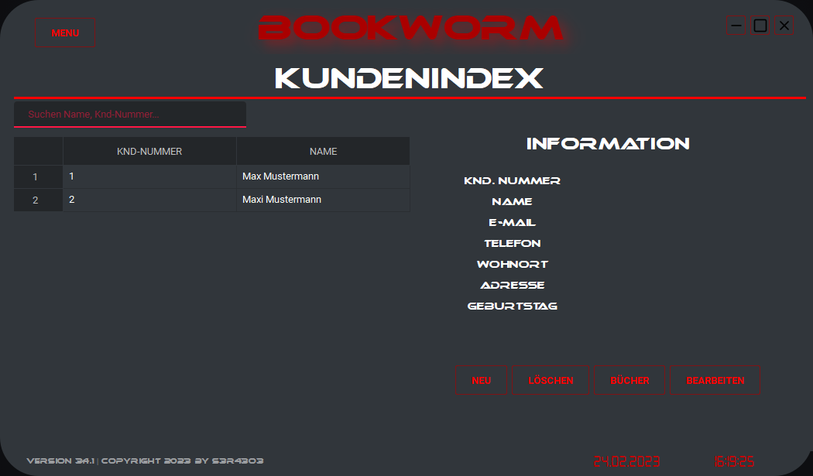

# BookWorm #

A Bookmanagementsystem for librarys. This Tool provides a userfriendly GUI made with Python and PySide6. I made this software for my girlfriend, she work in a library and she need a tool to index all the books and manage them.

## Features ##

Please notice the software is currently only available in german. A english version will follow.

This features are currently available:

> - Book-Database, save books with followed informations:
>   - Book-ISBN
>   - Booktitle
>   - Author
>   - Genre
>   - Lenddate
>   - Lender
>   - Availability
> - User-Database, save followed userinformation:
>   - User-ID
>   - Personal information (birthday, age, name, address, phone, mailaddress)
>   - a list with lended books
> - Edit Userinformation
> - Import/Export the bookindex to .csv, .txt or .json
> - Backup full Data or Restore backup
> - GUI that shows up all data and let you manage books and user
> - Add, remove, lend books
> - Realtime logging for better support

## Installation ##

The software is only tested on Windows 10/11 not on Unix or others!
To install the software:

> - Download the last [release](https://github.com/sera619/Bookworm-Bookmanagementsystem/releases).
> - Extract the ZIP-File in a directory of your choice.
> - Run the Setup-Bookworm.exe and follow the installationmenu.
> - The installer will save the software at 'C:\Program Files (x86)\Creative Dudes Studio\Bookworm'
> - After installation, navigate to the installationdirectory and run 'Bookworm.exe'
> - If you facing any issue or have some other trouble, please open a [new Issue](https://github.com/sera619/Bookworm-Bookmanagementsystem/issues)

## Screenshots ##

> - 
> - 
> - 
> - 
> - 
> - 
> - 
> - 
> - 
